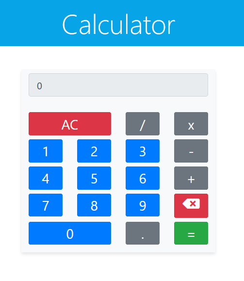

# JavaScript Calculator

> Javascript calculator built with HTML,CSS, Javascript, JQuery and Bootstrap. Check it out here [Live Demo](https://muzhaqi16.github.io/javascript-calculator/)

## **Table of Contents**
- [Technologies](#technologies%20used)
- [Screenshot](#screenshot)
- [User Stories](#user%20stories)
- [Contributing](#contributing)
- [Team](#team)
- [License](#license)

## Technologies Used

- `HTML`
- `CSS, Bootstrap`
- `JavaScript, jQuery`

## Screenshot

## User Stories

### User Story #1: 

> In any order, I should be able to `add`, `subtract`, `multiply` and `divide` a chain of numbers of `any length`, and when I hit `=`, the correct result should be shown.

### User Story #2: 

> When inputting numbers, my calculator should not allow a number to `begin` with `multiple zeros`.

### User Story #3: 

> When the `decimal` element is clicked, a `.` should append to the currently displayed value; `two` `.` in one number should not be accepted.

### User Story #4: 

> I should be able to perform any operation (+, -, *, /) on numbers containing `decimal points`.

### User Story #5: 

> If 2 or more operators are entered consecutively, the operation performed should be the last operator entered (excluding the negative (-) sign). For example, if `5 + * 7 =` is entered, the result should be `35` (i.e. 5 * 7); if `5 * - 5 =` is entered, the result should be `-25` (i.e. 5 x (-5)).

### User Story #6: 

> Pressing an operator immediately following `=` should start a `new calculation` that operates on the result of the `previous` evaluation.

### User Story #7: 

> My calculator should have several decimal places of precision when it comes to rounding (note that there is no exact standard, but you should be able to handle calculations like `2 / 7` with reasonable precision to at least 4 decimal places).

## How to use it:

- Clone this repo to your local machine using 

    `git clone https://github.com/muzhaqi16/javascript-calculator.git`
- Go inside the new folder that was cloned into `javascript-calculator`
- Open `index.html` with your favourite browser

---

## Contributing

> I would love your contribution at making this repo better and adding new features. 
> To get started at contributing at this repo follow the steps below...

### Step 1

- **Option 1**
    - 🍴 Fork this repo!

- **Option 2**
    - 👯 Clone this repo to your local machine using `https://github.com/muzhaqi16/javascript-calculator.git`

### Step 2

- **HACK AWAY!** 🔨🔨🔨

### Step 3

- 🔃 Create a new pull request using <a href="https://github.com/muzhaqi16/javascript-calculator.git/compare" target="_blank">`https://github.com/muzhaqi16/javascript-calculator.git/compare`</a>.

---

## License

- **[MIT license](http://opensource.org/licenses/mit-license.php)**
- Copyright 2020 © <a href="http://muzhaqi.com" target="_blank">Artan Muzhaqi</a>.